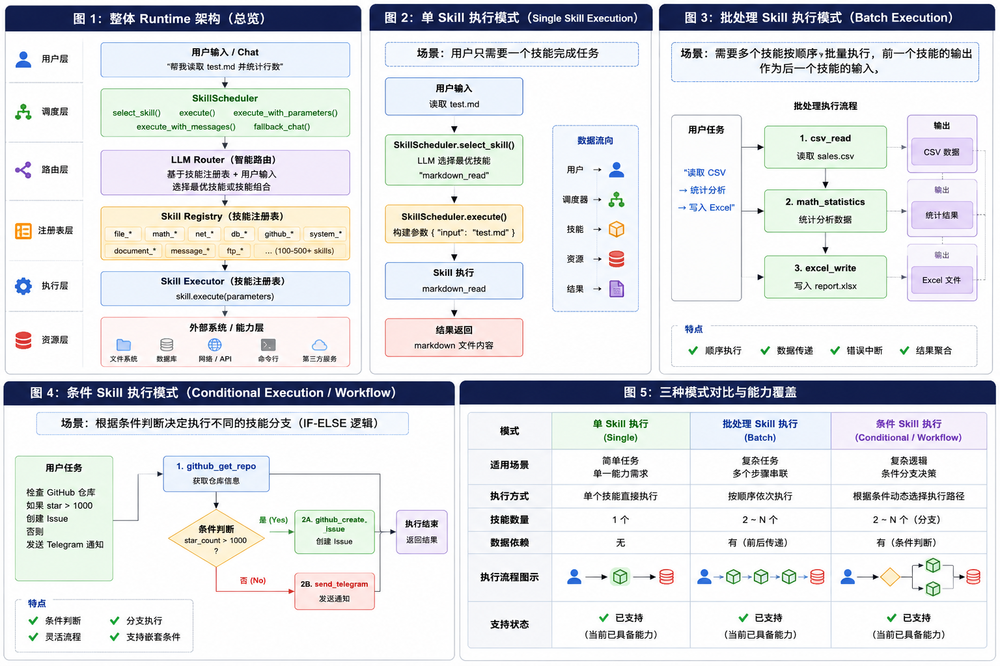

<p align="center">
    
</p>
<h1 align="center">
    HippoX
</h1>
<h4 align="center">
一个可靠的AI代理与Skills编排运行时引擎. <br>
一个Skill驱动的AI代理引擎, 你只需要编写 `SKILL.md` 文件来描述技能就能自动加载并执行.
</h4>
<p align="center">
  <a href="https://github.com/0xhappyboy/hippo/blob/main/LICENSE"></a>
    <a href="https://crates.io/crates/hippox">

</a>
</p>
<p align="center">
<a href="./README_zh-CN.md">简体中文</a> | <a href="./README.md">English</a>
</p>

## 基础使用

```rust
use hippox::{Hippox, ModelProvider, core::ConfigInitMethod};

#[tokio::main]
async fn main() -> anyhow::Result<()> {
    // 方式1: 从环境变量加载
    let hippox = Hippox::new(
        "./skills",
        ModelProvider::OpenAI,
        Some("api-key".to_string()),
        None,
        ConfigInitMethod::Env,
    ).await?;
    // 方式2: 从 TOML 文件加载
    let hippox = Hippox::new(
        "./skills",
        ModelProvider::OpenAI,
        Some("api-key".to_string()),
        None,
        ConfigInitMethod::TomlFile("config.toml".to_string()),
    ).await?;
    // 方式3: 从 JSON 文件加载
    let hippox = Hippox::new(
        "./skills",
        ModelProvider::OpenAI,
        Some("api-key".to_string()),
        None,
        ConfigInitMethod::JsonFile("config.json".to_string()),
    ).await?;
    // 方式4: 从 JSON 字符串加载
    let config_json = r#"{"lang": "zh", "provider": "openai"}"#.to_string();
    let hippox = Hippox::new(
        "./skills",
        ModelProvider::OpenAI,
        Some("api-key".to_string()),
        None,
        ConfigInitMethod::ParamsJsonStr(config_json),
    ).await?;
    let response = hippox.handle_natural_language("计算 15 + 27", Some("session-1")).await;
    println!("{}", response);
    Ok(())
}
```

## 配置文件格式

### 环境变量

```bash
export HIPPOX_LANG=zh
export HIPPOX_SMTP_HOST=smtp.gmail.com
export HIPPOX_SMTP_PORT=587
```

### TOML 格式 (`config.toml`)

```toml
lang = "zh"
enable_cli = true

[smtp]
host = "smtp.gmail.com"
port = 587
```

### JSON 格式 (`config.json`)

```json
{
  "lang": "zh",
  "smtp_host": "smtp.gmail.com",
  "smtp_port": 587
}
```

## Skill调度模型



## 原子Skill清单

| Skill 名称           | 描述                                      | 参数                                                                      | 分类     |
| -------------------- | ----------------------------------------- | ------------------------------------------------------------------------- | -------- |
| mysql_query          | 执行 MySQL SELECT 查询                    | query(必填), params, limit                                                | 数据库   |
| mysql_execute        | 执行 MySQL INSERT/UPDATE/DELETE           | query(必填), params                                                       | 数据库   |
| mysql_list_tables    | 列出 MySQL 中的所有表                     | 无                                                                        | 数据库   |
| postgres_query       | 执行 PostgreSQL SELECT 查询               | query(必填), params, limit                                                | 数据库   |
| postgres_execute     | 执行 PostgreSQL INSERT/UPDATE/DELETE      | query(必填), params                                                       | 数据库   |
| postgres_list_tables | 列出 PostgreSQL 中的所有表                | schema                                                                    | 数据库   |
| redis_set            | 设置 Redis 键值对                         | key(必填), value(必填), ttl                                               | 数据库   |
| redis_get            | 根据 key 获取 Redis 值                    | key(必填)                                                                 | 数据库   |
| redis_del            | 删除 Redis 中的 key                       | key(必填)                                                                 | 数据库   |
| redis_keys           | 根据模式匹配 Redis 中的 key               | pattern                                                                   | 数据库   |
| redis_hset           | 设置 Redis 哈希表中的字段                 | key(必填), field(必填), value(必填)                                       | 数据库   |
| redis_hget           | 获取 Redis 哈希表中的字段值               | key(必填), field(必填)                                                    | 数据库   |
| sqlite_query         | 执行 SQLite SELECT 查询                   | query(必填), params, limit                                                | 数据库   |
| sqlite_execute       | 执行 SQLite INSERT/UPDATE/DELETE          | query(必填), params                                                       | 数据库   |
| sqlite_list_tables   | 列出 SQLite 中的所有表                    | 无                                                                        | 数据库   |
| github_get_repo      | 获取 GitHub 仓库信息                      | owner(必填), repo(必填)                                                   | GitHub   |
| github_create_issue  | 在 GitHub 仓库中创建 Issue                | owner, repo, title(必填), body, labels                                    | GitHub   |
| github_list_issues   | 列出 GitHub 仓库中的 Issue                | owner, repo, state, limit                                                 | GitHub   |
| github_star_repo     | 给 GitHub 仓库加星标                      | owner(必填), repo(必填)                                                   | GitHub   |
| github_search_repos  | 搜索 GitHub 仓库                          | query(必填), limit                                                        | GitHub   |
| github_get_user      | 获取 GitHub 用户信息                      | username(必填)                                                            | GitHub   |
| github_list_prs      | 列出 GitHub 仓库中的 Pull Request         | owner, repo, state, limit                                                 | GitHub   |
| csv_read             | 读取并解析 CSV 文件内容                   | path(必填), has_header, delimiter, limit                                  | 文档处理 |
| csv_write            | 将结构化数据写入 CSV 文件                 | path(必填), headers(必填), rows(必填), delimiter                          | 文档处理 |
| excel_read           | 读取 Excel (.xlsx) 文件数据               | path(必填), sheet, has_header, limit                                      | 文档处理 |
| excel_write          | 将数据写入 Excel (.xlsx) 文件             | path(必填), headers(必填), rows(必填), sheet_name                         | 文档处理 |
| markdown_read        | 读取并解析 Markdown 文件内容              | path(必填), extract_frontmatter                                           | 文档处理 |
| markdown_write       | 将 Markdown 内容写入文件                  | path(必填), content(必填), append                                         | 文档处理 |
| xml_parse            | 解析 XML 内容（文件或字符串）             | source(必填), is_path, xpath                                              | 文档处理 |
| xml_to_json          | 将 XML 内容转换为 JSON 格式               | source(必填), is_path, pretty                                             | 文档处理 |
| file_copy            | 复制或移动文件                            | source(必填), destination(必填), move                                     | 文件操作 |
| file_delete          | 删除文件或空目录                          | path(必填), recursive                                                     | 文件操作 |
| file_list            | 列出目录内容                              | path(必填), show_hidden, detail                                           | 文件操作 |
| file_read            | 读取文件内容                              | path(必填), max_size                                                      | 文件操作 |
| file_write           | 将内容写入文件                            | path(必填), content(必填), append                                         | 文件操作 |
| calculator           | 计算数学表达式                            | expression(必填), precision                                               | 数学计算 |
| unit_converter       | 单位换算（长度）                          | value(必填), from(必填), to(必填), precision                              | 数学计算 |
| math_power           | 计算幂、平方根或立方根                    | base, exponent, sqrt, cbrt, precision                                     | 数学计算 |
| math_statistics      | 计算一组数字的统计值                      | numbers(必填), operation(必填), precision                                 | 数学计算 |
| send_dingding        | 通过钉钉机器人发送消息                    | text(必填), at_mobiles, at_all, msg_type, title                           | 消息通知 |
| send_email           | 通过 SMTP 服务器发送邮件                  | to(必填), subject(必填), body(必填), from, cc, bcc, is_html               | 消息通知 |
| send_feishu          | 通过飞书机器人发送消息                    | text, msg_type, title, content, image_key, at_mobiles, at_all             | 消息通知 |
| send_telegram        | 通过 Telegram 机器人发送消息              | chat_id(必填), text(必填), parse_mode, disable_notification               | 消息通知 |
| send_wecom           | 通过企业微信机器人发送消息                | text(必填), msg_type, mentioned_list, mentioned_mobile_list               | 消息通知 |
| ftp_upload           | 上传文件到 FTP 服务器                     | host, port, username, password, local_path(必填), remote_path, mode       | 网络通信 |
| ftp_download         | 从 FTP 服务器下载文件                     | host, port, username, password, remote_path(必填), local_path(必填), mode | 网络通信 |
| ftp_list             | 列出 FTP 服务器目录内容                   | host, port, username, password, directory                                 | 网络通信 |
| ftp_delete           | 删除 FTP 服务器上的文件                   | host, port, username, password, remote_path(必填)                         | 网络通信 |
| http_request         | 发送 HTTP 请求到 Web API                  | url(必填), method, headers, body, timeout                                 | 网络通信 |
| read_url             | 获取 URL 内容                             | url(必填), method, headers, timeout, max_size, raw                        | 网络通信 |
| tcp_send             | 通过 TCP 连接发送数据                     | host, port, data(必填), encoding, timeout, delimiter, wait_response       | 网络通信 |
| tcp_receive          | 监听 TCP 端口接收数据（服务端模式）       | port(必填), bind_address, buffer_size, timeout, encoding, send_response   | 网络通信 |
| udp_send             | 通过 UDP 发送数据                         | host, port, data(必填), encoding, timeout                                 | 网络通信 |
| udp_receive          | 接收 UDP 数据报                           | port(必填), bind_address, buffer_size, timeout, encoding, send_response   | 网络通信 |
| udp_broadcast        | 发送 UDP 广播消息                         | port(必填), data(必填), encoding, timeout                                 | 网络通信 |
| exec_command         | 执行系统命令                              | command, args, timeout, working_dir, env                                  | 系统操作 |
| system_info          | 获取系统信息（操作系统、CPU、内存、磁盘） | info_type                                                                 | 系统操作 |
| datetime             | 获取当前时间日期或时区转换                | operation, timezone, format                                               | 时间工具 |

## 环境变量

| 环境变量                     | 说明                  | 默认值 | 可选值                              |
| ---------------------------- | --------------------- | ------ | ----------------------------------- |
| HIPPOX_LANG                  | 语言设置              | en     | zh, en                              |
| HIPPOX_PROVIDER              | LLM 提供商            | openai | openai, deepseek, anthropic, google |
| HIPPOX_ENABLE_CLI            | 启用 CLI 命令行交互   | true   | true, false                         |
| HIPPOX_ENABLE_TCP            | 启用 TCP 服务器       | false  | true, false                         |
| HIPPOX_ENABLE_HTTP           | 启用 HTTP 服务器      | false  | true, false                         |
| HIPPOX_ENABLE_WS             | 启用 WebSocket 服务器 | false  | true, false                         |
| HIPPOX_SMTP_HOST             | SMTP 服务器地址       | 无     | smtp.gmail.com                      |
| HIPPOX_SMTP_PORT             | SMTP 服务器端口       | 587    | 465, 587                            |
| HIPPOX_SMTP_USERNAME         | SMTP 认证用户名       | 无     | your@gmail.com                      |
| HIPPOX_SMTP_PASSWORD         | SMTP 认证密码         | 无     | 邮箱密码                            |
| HIPPOX_SMTP_FROM             | 默认发件人地址        | 无     | bot@example.com                     |
| HIPPOX_TELEGRAM_BOT_TOKEN    | Telegram Bot Token    | 无     | 1234567890:xxxxxxxxxxxxxxxx         |
| HIPPOX_DINGDING_ACCESS_TOKEN | 钉钉机器人Token       | 无     | 钉钉 web hook token                 |
